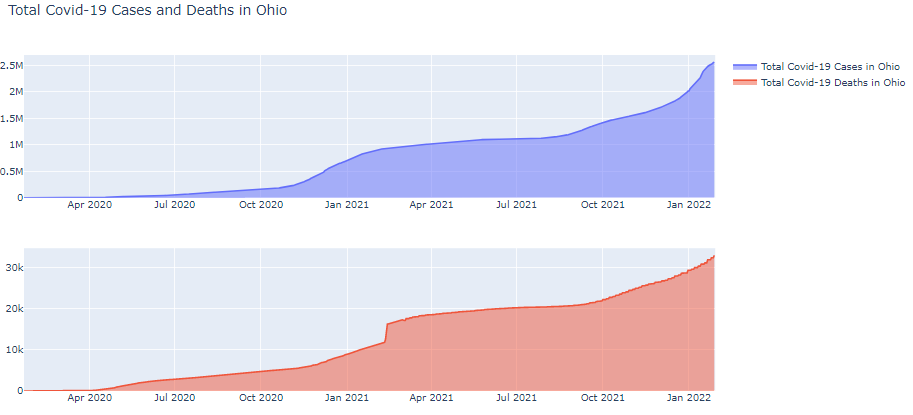

# The-Art-of-Analyzing-Big-Data---The-Data-Scientist-Toolbox

This repository includes all tasks notebooks, final project, and final exam work created as part of the Ben-Gurion University of the Negev course "The Art of Analyzing Big Data - The Data Scientist’s Toolbox". 

The course discusses principles, methodologies, and techniques for mining massive datasets. In this course, we learned how to perform common data mining tasks, such as classification, clustering analysis, and recommendation on large datasets using the principles of parallel and distributed processing such as Map-Reduce. During the course, I had the opportunity to use state-of-the-art technologies for massive data mining. Each of the tasks tackles different machine learning and big data issues. [Course web site](https://data4goodlab.github.io/lectures.html).

---
## [Final Exam Work](Covid-19_olympics_and_topic_models/Data_Science_Final_Exam.ipynb)

  
  
  
   

In the notebook, I tackled four different tasks.

### Covid-19 data analysis. 
It includes visualizing the daily Covid-19 cases in Ohio over time that gives us a high-level perspective of the infection rate and the so-called "waves". There are further in-depth analyses of hospitalization, vaccination, unemployment, and school data.

### Communities Identification using Modularity. 
Identifing teams of 3 members, competing together for more then 10 competitions in Kaggle competiotions.
For each community, multiple centrality measures where calculated:
degree_centrality - Average degree, Most central node
pagerank - Average pagerank, Most central node
closeness_centrality - Average score, Most central node

### Forums Topic Models

### Olympic Medals analysis - Predicting Sucess and extra ordinary achievement.
In this section a model is trained to predict an athlete achievement based on the physical features, sport type, and the athlete's country. If a sufficiently trained model predicts that an athlete would loss, and yet the athlete wins a gold medal, this is an extra ordinary achievement. This holds to the other direction as well. If a trained model predicts that the athlete would win a gold medal, and the athlete losses all medals, then this is a disappointing loss.

---
## Assignments

  
  
   
  
   
  
  

### Big Data Analysis
[Assignment 1](Assignments/Data_Sceince_HW_1.ipynb) - DB, SQL, various datasets, sqlite3 package

### Collecting, Analyzing, and Visualizing Data with Python
[Assignment 2](Assignments/Data_Sceince_HW_2.ipynb) - Scraping with beautiful soup, working with API's and pandas, networkx.

[Assignment 3](Assignments/Data_Sceince_HW_3.ipynb) - Data visualization using turicreate, pandas and seaborn.

### Analyzing Massive Graphs
[Assignment 4](Assignments/Data_Sceince_HW_4.ipynb) - Working with graphs.

[Assignment 5](Assignments/Data_Sceince_HW_5.ipynb) - Link predictions and graph analysis.

### From Unstructured Text to Structured Data
[Assignment 6](Assignments/Data_Sceince_HW_6.ipynb) - NLP and Sentiment analysis and classification.

[Assignment 7](Assignments/Data_Sceince_HW_7.ipynb) - From Unstructured Text to Structured Data - NLP, entity extraction, networks and visualization.

### Working with GEOLocation Data
[Assignment 8](Assignments/Data_Sceince_HW_8.ipynb) - Geopandas, plotly express and foluim.

[Assignment 9](Assignments/Data_Sceince_HW_9.ipynb) - Extracting Data from Images and Sounds - working with pySpark, classifiers map visualization and more.

### Big Data and Visualization
[Assignment 10](Assignments/Data_Sceince_HW_10.ipynb) - pySpark, heatmap visualizations and folium.

<!--- 

--->

